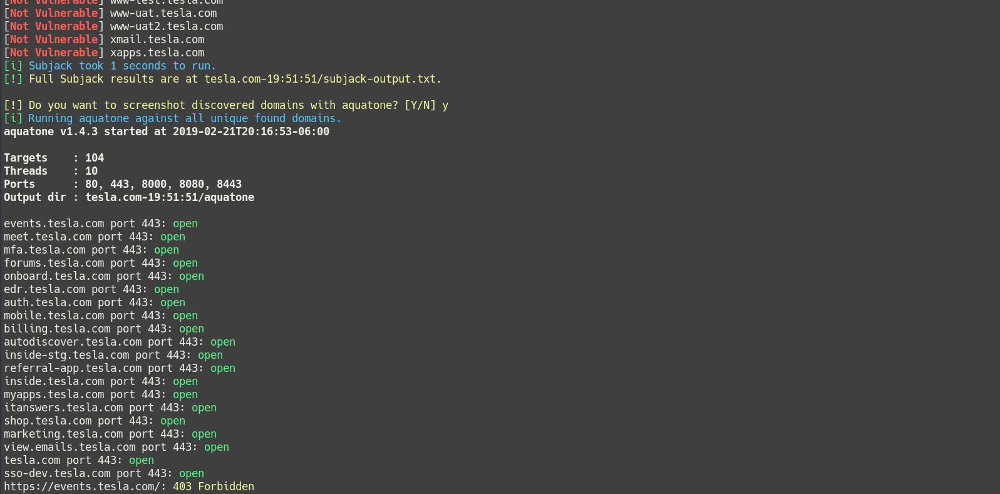
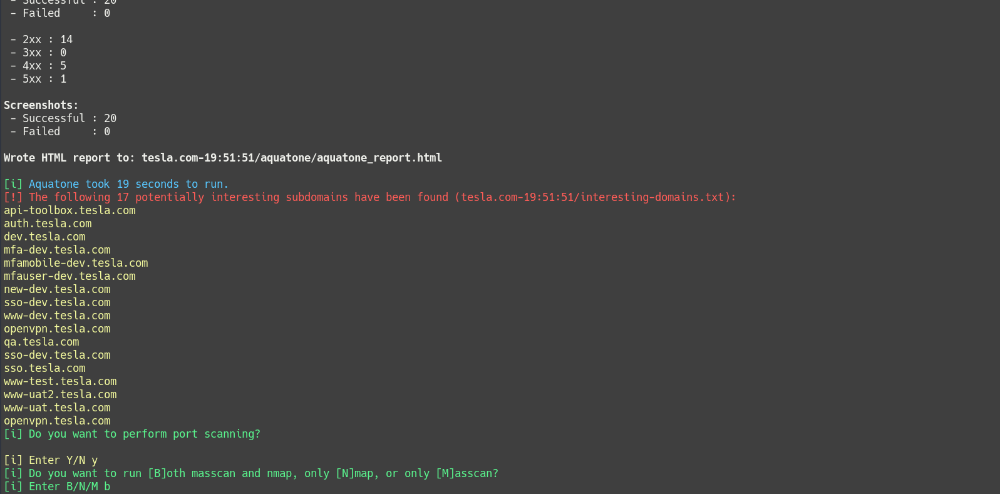

# Chomp Scan


A scripted pipeline of tools to simplify the bug bounty/penetration test reconnaissance phase, so you can focus on chomping bugs.


### Scope
Chomp Scan is a Bash script that chains together the fastest and most effective tools (in my opinion/experience) for doing the long and sometimes tedious process of recon. No more looking for word lists and trying to remember when you started a scan and where the output is. Chomp Scan creates a timestamped output directory based on the search domain, e.g. *example.com-21:38:15*, and puts all tool output there, split into individual sub-directories as appropriate. Custom output directories are also supported via the `-o` flag.

Chomp Scan runs in multiple modes. The primary one is using command-line arguments to select which scanning phases to use, which wordlists, etc. A guided interactive mode is available, as well as a non-interactive mode, useful if you do not want to deal with setting multiple arguments.

A list of interesting words is included, such as *dev, test, uat, staging,* etc., and domains containing those terms are flagged. This way you can focus on the interesting domains first if you wish. This list can be customized to suit your own needs, or replaced with a different file via the `-X` flag.

A blacklist file is included, to exclude certain domains from the results. However it does not prevent those domains from being resolved, only from being used for port scanning and content discovery. It can be passed via the `-b` flag.

Chomp Scan supports limited canceling/skipping of tools by pressing Ctrl-c. This can sometimes have unintended side effects, so use with care.

**Note: Chomp Scan is still in development, and new/different tools will be added as I find them. Pull requests and comments welcome!**

### Scanning Phases

#### Subdomain Discovery (3 different sized wordlists)
* dnscan
* subfinder
* sublist3r
* massdns + altdns

#### Screenshots (optional)
* aquatone

#### Port Scanning (optional)
* masscan and/or nmap
* nmap output styled with [nmap-bootstrap-xsl](https://github.com/honze-net/nmap-bootstrap-xsl/)

#### Information Gathering (optional) (4 different sized wordlists)
* subjack
* bfac
* whatweb
* wafw00f
* nikto

#### Content Discovery (optional) (4 different sized wordlists)
* ffuf
* gobuster

### Wordlists

A variety of wordlists are used, both for subdomain bruteforcing and content discovery. Daniel Miessler's [Seclists](https://github.com/danielmiessler/SecLists) are used heavily, as well as Jason Haddix's [lists](https://gist.github.com/jhaddix). Different wordlists can be used by changing relevant variables at the top of the script.

#### Subdomain Bruteforcing
* subdomains-top1mil-20000.txt - 22k words - From [Seclists](https://github.com/danielmiessler/SecLists)
* sortedcombined-knock-dnsrecon-fierce-reconng.txt - 102k words - From [Seclists](https://github.com/danielmiessler/SecLists) 
* huge-200k.txt - 199k words - A combination I made of various wordlists, including Seclists

#### Content Discovery
* big.txt - 20k words - From [Seclists](https://github.com/danielmiessler/SecLists)
* raft-large-combined.txt - 167k words - A combination of the raft wordlists in [Seclists](https://github.com/danielmiessler/SecLists)
* seclists-combined.txt - 215k words - A larger combination of all the Discovery/DNS lists in [Seclists](https://github.com/danielmiessler/SecLists)
* haddix_content_discovery_all.txt - 373k words - Jason Haddix's [all](https://gist.github.com/jhaddix/b80ea67d85c13206125806f0828f4d10/) content discovery list
* haddix-seclists-combined.txt - 486k words - A combination of the two previous lists

#### Misc.
* altdns-words.txt - 240 words - Used for creating domain permutations for [masscan](https://github.com/robertdavidgraham/masscan) to resolve. Borrowed from [altdns](https://github.com/infosec-au/altdns/blob/master/words.txt).
* interesting.txt - 42 words - A list I created of potentially interesting words appearing in domain names.

### Usage
Chomp Scan always runs subdomain enumeration, thus a domain is required via the `-u` flag. The domain should not contain a scheme, e.g. http:// or https://. A wordlist is optional, and if one is not provided the built-in short list (20k words) is used.

Other scan phases are optional. Content discovery can take an optional wordlist, otherwise it defaults to the built-in short (22k words) list.
```
chomp-scan.sh -u example.com -a d short -cC large -p -o path/to/directory

Usage of Chomp Scan:
        -u domain
                 (required) Domain name to scan. This should not include a scheme, e.g. https:// or http://.
        -d wordlist
                 (optional) The wordlist to use for subdomain enumeration. Three built-in lists, short, long, and huge can be used, as well as the path to a custom wordlist. The default is short.
        -c
                 (optional) Enable content discovery phase. The wordlist for this option defaults to short if not provided.
        -C wordlist
                 (optional) The wordlist to use for content discovery. Five built-in lists, small, medium, large, xl, and xxl can be used, as well as the path to a custom wordlist. The default is small.
        -s
                 (optional) Enable screenshots using Aquatone.
        -i
                 (optional) Enable information gathering phase, using subjack, bfac, whatweb, wafw00f, and nikto.
        -p
                 (optional) Enable portscanning phase, using masscan (run as root) and nmap.
        -I
                 (optional) Enable interactive mode. This allows you to select certain tool options and inputs interactively. This cannot be run with -D.
        -D
                 (optional) Enable default non-interactive mode. This mode uses pre-selected defaults and requires no user interaction or options. This cannot be run with -I.
                            Options: Subdomain enumeration wordlist: short.
                                     Content discovery wordlist: small.
                                     Aquatone screenshots: yes.
                                     Portscanning: yes.
                                     Information gathering: yes.
                                     Domains to scan: all unique discovered.
        -b wordlist
                 (optional) Set custom domain blacklist file.
        -X wordlist
                 (optional) Set custom interesting word list.
        -o directory
                 (optional) Set custom output directory. It must exist and be writable.
        -a
                 (optional) Use all unique discovered domains for scans, rather than interesting domains. This cannot be used with -A.
        -A
                 (optional, default) Use only interesting discovered domains for scans, rather than all discovered domains. This cannot be used with -a.
        -h
                 (optional) Display this help page.
```

### Installation
Clone this repo and ensure that the below dependencies are met. Having a [working installation of Go](https://linuxize.com/post/how-to-install-go-on-debian-9/) will help with several of the tools.

```
git clone https://github.com/SolomonSklash/chomp-scan.git;
sudo apt install sublist3r masscan nmap nikto gobuster chromium whatweb wafw00f -y;
go get github.com/subfinder/subfinder;
go get github.com/haccer/subjack;
go get github.com/ffuf/ffuf;
mkdir -pv ~/bounty/tools/aquatone;
wget https://github.com/michenriksen/aquatone/releases/download/v1.4.3/aquatone_linux_amd64_1.4.3.zip -O ~/bounty/tools/aquatone/aquatone.zip;
uzip ~/bounty/tools/aquatone/aquatone.zip -d ~/bounty/tools/aquatone; # Unzip aquatone
git clone https://github.com/rbsec/dnscan.git ~/bounty/tools/dnscan;
git clone https://github.com/infosec-au/altdns.git ~/bounty/tools/altdns; 
git clone https://github.com/blechschmidt/massdns.git ~/bounty/tools/massdns; 
cd ~/bounty/tools/massdns; make; # Compiling massdns, see repo for details
git clone https://github.com/mazen160/bfac.git ~/bounty/tools/bfac;
```

Then make sure the path variables for each tool are set. Currently they default to ~/bounty/tools/[tool-repo]/[tool-file].
```
# Tool paths
SUBFINDER=$(command -v subfinder);
SUBLIST3R=$(command -v sublist3r);
SUBJACK=$(command -v subjack);
FFUF=$(command -v ffuf);
WHATWEB=$(command -v whatweb);
WAFW00F=$(command -v wafw00f);
GOBUSTER=$(command -v gobuster);
CHROMIUM=$(command -v chromium);
DNSCAN=~/bounty/tools/dnscan/dnscan.py;
ALTDNS=~/bounty/tools/altdns/altdns.py;
MASSDNS_BIN=~/bounty/tools/massdns/bin/massdns;
MASSDNS_RESOLVERS=~/bounty/tools/massdns/lists/resolvers.txt;
AQUATONE=~/bounty/tools/aquatone/aquatone;
BFAC=~/bounty/tools/bfac/bfac;
```

### Dependencies

The following tools are required for Chomp Scan. Note that this tool was designed with Kali Linux in mind, so certain tools are expected to be available via package manager.

* [sublist3r](https://github.com/aboul3la/Sublist3r) - Kali package
* [masscan](https://github.com/robertdavidgraham/masscan) Kali package
* [nmap](https://www.nmap.org) Kali package
* [nikto](https://cirt.net/nikto2) Kali package
* [gobuster](https://github.com/OJ/gobuster) Kali package
* [whatweb](https://www.morningstarsecurity.com/research/whatweb) Kali package
* [wafw00f](https://github.com/EnableSecurity/wafw00f) Kali package
* [chromium](https://www.chromium.org/) Kali package (needed for aquatone)
* [dnscan](https://github.com/rbsec/dnscan)- Python
* [altdns](https://github.com/infosec-au/altdns) - Python
* [bfac](https://github.com/mazen160/bfac) Python3
* [massdns](https://github.com/blechschmidt/massdns) - Compiled with C
* [subfinder](https://github.com/subfinder/subfinder) - Go
* [subjack](https://github.com/haccer/subjack) Go
* [ffuf](https://github.com/ffuf/ffuf) Go
* [aquatone](https://github.com/michenriksen/aquatone) Precompiled Go binary

### In The Future

Chomp Scan is still in active development, as I use it myself for bug hunting, so I intend to continue adding new features and tools as I come across them. New tool suggestions, feedback, and pull requests are all welcomed. Here is a short list of potential additions I'm considering:

* Adding a config file, for more granular customization of tools and parameters
* A possible Python re-write (and maybe a Go re-write after that!)
* The generation of an HTML report, similar to what aquatone provides

### Examples





## Thanks
Thanks to all the authors of the included tools. They do all the heavy lifting.
