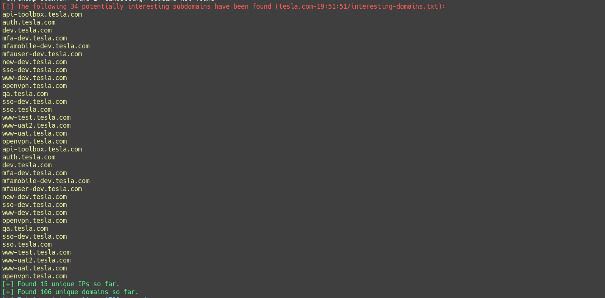

# Chomp Scan

A scripted combination of tools to simplify the bug bounty/penetration test reconnaissance phase, so you can focus on chomping bugs.


### Scope
Chomp Scan is a Bash script that strings together the (in my opinion/experience) fastest and most effective tools for doing the long and sometimes tedious process of recon. No more looking for word lists and trying to remember when you started a scan and where the ouput is. Chomp Scan creates a timestamped output directory based on the search domain, e.g. example.com-21:38:15, and puts all tool output there, split into individual sub-directories as appropriate.

Various prompts appear asking what wordlists to use, whether to use [aquatone](https://github.com/michenriksen/aquatone) to take screenshots of discovered domains, whether to perform port scanning, and whether to begin bruteforce content discovery.

A list of interesting words is included, such as *dev, test, uat, staging,* etc., and domains containing those terms are flagged. This way you can focus on the interesting domains first if you wish. This list can be customized to suit your own needs.

A blacklist file is included, to exclude certain domains from the results. However it does not prevent those domains from being resolved, only from being used for port scanning and content discovery.

**Note: Chomp Scan is still in development, and new/different tools will be added as I find them. Pull request and comments welcome!**

### Scanning Phases

#### Subdomain Discovery (3 different sized wordlists)
* dnscan
* subfinder
* sublist3r
* massdns + altdns
* subjack

#### Screenshots (optional)
* aquatone

#### Port Scanning (optional)
* masscan and/or nmap

#### Content Discovery (optional) (4 different sized wordlists)
* ffuf
* bfac
* nikto


### Wordlists

A variety of wordlists are used, both for subdomain bruteforcing and content dicovery. Daniel Miessler's [Seclists](https://github.com/danielmiessler/SecLists) are used heavily, as well as Jason Haddix's lists. Different wordlists can be used by changing relevant variables at the top of the script.

#### Subdomain Bruteforcing
* subdomains-top1mil-20000.txt - From [Seclists](https://github.com/danielmiessler/SecLists)
* sortedcombined-knock-dnsrecon-fierce-reconng.txt - From [Seclists](https://github.com/danielmiessler/SecLists) 
* huge-200k - A combination I made of various wordlists, including Seclists

#### Content Discovery
* big.txt - From [Seclists](https://github.com/danielmiessler/SecLists)
* raft-large-combined.txt - A combination of the raft wordlists in [Seclists](https://github.com/danielmiessler/SecLists)
* seclists-combined.txt - A larger combination of all the Discovery/DNS lists in [Seclists](https://github.com/danielmiessler/SecLists)
* haddix_content_discovery_all.txt - Jason Haddix's [all](https://gist.github.com/jhaddix/b80ea67d85c13206125806f0828f4d10/) content discovery list
* haddix-seclists-combined.txt - A combination of the two previous lists

#### Misc.
* altdns-words.txt - Used for creating domain permutations for [masscan](https://github.com/robertdavidgraham/masscan) to resolve. Borrowed from [altdns](https://github.com/infosec-au/altdns/blob/master/words.txt).

### Installation
Clone this repo and ensure that the below dependencies are met. Having a working installation of Go will help with several of the tools.

Then make sure the path variables for each tool are set. Currenttly they default to ~/bounty/tools/[tool-repo]/[tool-file]
```
# Tool paths
SUBFINDER=$(command -v subfinder);
SUBLIST3R=$(command -v sublist3r);
SUBJACK=$(command -v subjack);
FFUF=$(command -v ffuf);
GOBUSTER=$(command -v gobuster);
CHROMIUM=$(command -v chromium);
DNSCAN=~/bounty/tools/dnscan/dnscan.py;
ALTDNS=~/bounty/tools/altdns/altdns.py;
MASSDNS_BIN=~/bounty/tools/massdns/bin/massdns;
MASSDNS_RESOLVERS=~/bounty/tools/massdns/lists/resolvers.txt;
AQUATONE=~/bounty/tools/aquatone/aquatone;
BFAC=~/bounty/tools/bfac/bfac;
```

### Dependencies

The following tools are required for Chomp Scan. Their paths can be set in the relevant variables at the top of the script. Note that this tool was designed with Kali Linux in mind.

* [dnscan](https://github.com/rbsec/dnscan)- Python
* [subfinder](https://github.com/subfinder/subfinder) - Go
* [sublist3r](https://github.com/aboul3la/Sublist3r) - Kali package
* [altdns](https://github.com/infosec-au/altdns) - Python
* [massdns](https://github.com/blechschmidt/massdns) - Compiled with C
* [subjack](https://github.com/haccer/subjack) Go
* [aquatone](https://github.com/michenriksen/aquatone) Precompiled Go binary
* [chromium](https://www.chromium.org/) (for aquatone)
* [masscan](https://github.com/robertdavidgraham/masscan) Kali package
* [nmap](https://www.nmap.org) Kali package
* [bfac](https://github.com/mazen160/bfac) Python3
* [nikto](https://cirt.net/nikto2) Kali package
* [gobuster](https://github.com/OJ/gobuster) Kali package
* [ffuf](https://github.com/ffuf/ffuf) Go

### Examples



